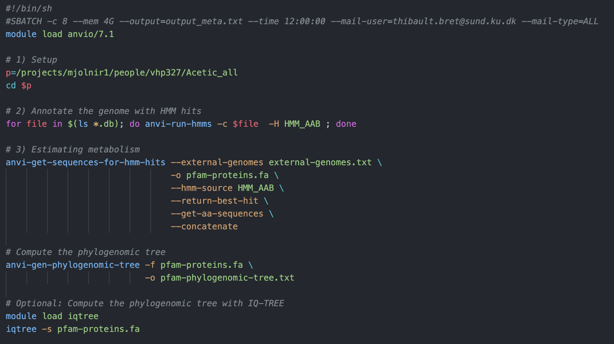
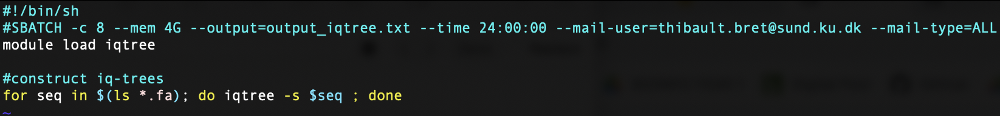

# July-August 2023 - New trees based on selected genes and pathways specific to acetic acid bacteria

## General tree
### Preface
- **Contigs database**: Generated by **Anvi'o**, a contigs database is equivalent to a FASTA file with the added advantage of being able to store additional information about the sequences it contains. In this project, each genome sequence was converted to a corresponding contigs database file ending with the suffix "*.CONTIGS.db*".
- **Pfam Accessions**: Pfam is a database of protein families that helps in identifying common motifs in protein families and domains. Each protein family in Pfam is assigned a unique identifier called a "Pfam accession".
- **Hidden Markov Models (HMMs)**: HMMs are probabilistic  models that are commonly used in statistical pattern recognition and classification. In this context, HMMs are generated to represent the characteristics of a given Pfam protein family and are based on patterns in their amino acid sequences. Generating HMMs will later allow us to scan through the genomes and identify matching sequences.

### Steps
1. List pathways/proteins/enzymes of interest and find the corresponding Pfam accessions by browsing the database. This is the only manual step of this pipeline.
*Note: The following code can only be run with **anvio-dev**, a corresponding module exists on the server but I could not make it work so I installed a version of **anvio-dev** locally following this tutorial:* https://anvio.org/install/#5-follow-the-active-development-youre-a-wizard-arry
2. Once everything is properly set up, activate the **anvio-dev** environment with:
```bash
conda activate anvio-dev
 ```
3. Given the list of Pfam accessions of interest, run the **anvi-script-pfam-accessions-to-hmms-directory** command to generate **Hidden Markov Models (HMMs)** corresponding to each Pfam sequence. This will later allow us to scan through any contigs database and detect the presence of matching sequences. An output folder for the HMMs also has to be provided, here we name it *HMM_AAB* (for Hidden Markov Model - Acetic Acid Bacteria).
```bash
anvi-script-pfam-accessions-to-hmms-directory --pfam-accessions-list PF03070 PF08042 PF13360 PF00171 PF00465 PF02317 PF00005 PF02887 PF00923 PF03971 PF00168 PF01161 PF13243 PF00330 PF17327 PF00196 PF00958 PF08240 PF00118  -O HMM_AAB
 ```
*Note: The rest of the code was run from the server in a file called metabolics.sh (shown below).*


4. Annotate the genomes with HMMs hits using the **anvi-run-hmms** command.
5. Now we can go through every contigs database (listed in the file *external-genomes.txt*) and retrieve sequences that got a hit for any given HMM using the **anvi-get-sequences-for-hmm-hits** command. The sequences are concatenated so that a phylogenetic tree can be drawn from them (as aligned sequences are a prerequisite). Furthermore, we select on the best hits using the *--return-best-hit* flag. From the Anvi'o manual: "This flag is most appropriate if one wishes to perform phylogenomic analyses, which ensures that for any given protein family, there will be only one gene reported from a given genome". The concatenated best hits are returned in the *pfam-proteins.fa* file.
6. Now a phylogenetic tree can be drawn from the *pfam-proteins.fa* file using the **anvi-gen-phylogenomic-tree** command. However, this will generate a rough tree which is not entirely reliable. Alternatively, a tree can drawn using IQ-TREE simply by using the following command:
```bash
iqtree -s pfam-proteins.fa
```
*Note: However, after trying to run this code, I noticed that the model selection process runs indefinitely (possibly because of the number of sequences the tree is based on). Therefore, I decided to stick to the Anvi'o-generated tree.*


## Individual trees
### 1) Set up HMMs
For each individual Pfam ID, generate a corresponding Hidden Markov Model.
```bash
pfams=("PF03070" "PF08042" "PF13360" "PF00171" "PF00465" "PF02317" "PF00005" "PF02887" "PF00923" "PF03971" "PF00168" "PF01161" "PF13243" "PF00330" "PF17327" "PF00196" "PF00958" "PF08240" "PF00118")
for pfam in "${pfams[@]}"; do anvi-script-pfam-accessions-to-hmms-directory --pfam-accessions-list $pfam -O HMMs/${pfam}_HMM ; done
```

### 2) Annotating the genome with HMM hits
```bash
for hmm in $(ls HMMs); do for file in *CONTIGS.db; do anvi-run-hmms -c "$file" -H HMMs/$hmm -T 4; done ; done
```

### 3) Estimating metabolism
```bash
cd HMMs
for hmm in $(ls); do anvi-get-sequences-for-hmm-hits --external-genomes ../external-genomes.txt -o  ../PFAM_seqs/${hmm%%_HMM}-proteins.fa --hmm-source $hmm --return-best-hit --get-aa-sequences --concatenate ; done
```
### 4) Building the trees with IQ-TREE

